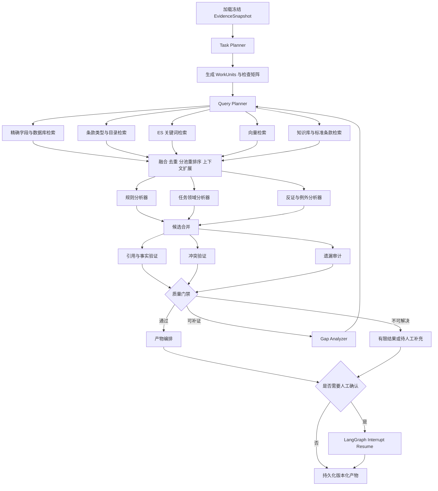
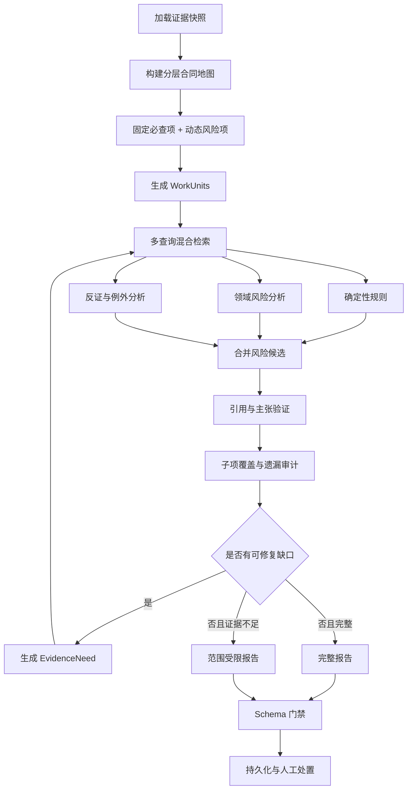

# AtlasMind 通用 Evidence Agent Harness 与高召回 DAG 改造 PRD

> 文档版本：v1.0  
> 日期：2026-08-14  
> 产品：AtlasMind Agent Workbench - ContractOps  
> 文档状态：待实施  
> 优先级：P0  
> 目标版本：Evidence Agent Harness v1 / Contract Graph v2  
> 主要范围：合同要素提取、履约日程提取、风险审查、履约证明核验、检索工具链、验证门禁、评测与可观测性  
> 关联文档：[合同 Agent 图运行时 PRD](./prd-contract-agent-graph-runtime-2026-08-05.md) · [合同作业系统六层架构](./contract-operations-six-layer-architecture-2026-08-08.md) · [履约核验 Agent 设计](./fulfillment-verification-agent-design-2026-08-04.md)

---

## 1. 文档目的

本文档定义 AtlasMind 合同 Agent 下一阶段的架构改造方案：在保留现有 LangGraph、Runtime Router、MySQL、Elasticsearch、知识库、规则引擎和人工确认机制的基础上，建设一套可被多个合同任务复用的 `Evidence Agent Harness`，并将现有偏线性的任务图逐步升级为以高召回、强证据、遗漏回查和人工复核为核心的 DAG。

本次改造需要同时解决两个看似冲突的目标：

1. 不为合同要素、履约日程、风险审查和履约核验分别重复开发检索、验证、反思与回补逻辑。
2. 不在缺少真实任务验证前，提前设计一个庞大且僵化的通用框架。

因此采用“最小公共模块先行、风险审查试点、评测验证、再固化通用 Harness、最后迁移其他任务”的渐进式路线。

---

## 2. 产品结论

### 2.1 核心决策

- 继续使用 LangGraph，不推倒现有 Runtime。
- 不建设一个包含全部合同业务的大图；每种任务保留独立 Graph 和独立产物。
- 建设一套公共 `Evidence Agent Harness`，统一处理证据快照、WorkUnit、检索、融合、验证、遗漏审计、有限回补、预算和可观测性。
- 第一阶段只抽取已被多个任务证明需要的公共模块，不立即抽象所有节点。
- 第一张增强图选择 `contract_review`，因为它已经具备领域规划、检索、规则、验证、Reflection 和回环基础。
- 风险图达到评测门槛后，再固化 `build_evidence_agent_graph(task_spec)`。
- 后续按 `contract_extraction`、`timeline_extraction`、`fulfillment_check` 的顺序迁移。
- 多 Agent 采用受控角色分工，不采用多个 Agent 自由对话、重复阅读全文或无限辩论。
- 准确率优先于速度；但必须通过缓存、增量重跑、并行检索和预算控制避免无边界增加成本。
- LLM 负责理解、候选生成、语义匹配、解释和建议；系统负责证据版本、工具权限、日期计算、状态、规则、门禁、最终持久化和人工确认边界。

### 2.2 一句话价值

把四套各自演进的合同 Agent 流程，升级为共享证据与质量能力、能够主动发现遗漏并定向补证的合同作业 DAG。

### 2.3 推荐实施顺序

```text
统一证据快照
    ↓
最小公共模块：检索编排 + 证据验证 + 缺口模型
    ↓
风险审查增强 DAG 试点
    ↓
评测证明召回率、精度和引用质量提升
    ↓
固化通用 Evidence Agent Harness
    ↓
迁移要素提取
    ↓
拆分并迁移履约日程
    ↓
迁移履约证明核验与人工 Resume
```

---

## 3. 背景与当前基线

### 3.1 已有能力

当前系统已经具备以下基础，不应重复建设：

- `RuntimeRouter` 按 `task_type` 路由到独立 Graph Adapter；
- LangGraph Checkpoint、Resume 和人工中断；
- 合同文档解析、条款切分、合同画像、时间节点、风险报告和履约证明；
- 合同条款的 MySQL 关键词、ES 关键词、向量召回和 RRF 融合；
- 模型 rerank 及关键词 fallback；
- 内置标准条款、管理端知识库和历史决策检索；
- 确定性规则引擎；
- 风险引用验证、Schema 验证、有限报告；
- Agent Run、Observation、Tool Call、Report、Checkpoint 和评测中心；
- 自动合同处理流水线：要素提取 → 正式履约日程 → 风险审查。

### 3.2 当前四张图

| Graph | 当前主要流程 | 当前判断 |
|---|---|---|
| `contract_review` | 上下文 → 条款目录 → 领域规划 → 检索 → 规则 → LLM 发现 → 引用验证 → 覆盖反思 → 定向检索 → 报告 | 已有 DAG 基础，适合作为试点 |
| `contract_extraction` | 上下文 → 固定要素包 → 检索 → LLM 提取 → 引用验证 → 画像 → 持久化 | 仍偏线性，缺少字段级遗漏回查 |
| `timeline_extraction` | 上下文 → 冻结快照 → 调用黑盒函数生成正式日程 | Graph 过薄，内部过程不可观测、不可局部重试 |
| `fulfillment_check` | 上下文 → 要求拆解 → 证据检索 → 判断 → 验证 → 人工确认 → 持久化 | 有状态机基础，但缺少逐要求的并行和缺口回补 |

### 3.3 已经开始的公共化工作

当前代码已经开始引入共享合同证据快照，目标是让不同 Graph 使用同一主合同文档、同一条款版本、同一已确认录入结果和同一要素快照。

该方向应继续完成，并成为本 PRD 的第一阶段，不应回退为每张图自行查询数据库、选择文档和拼装上下文。

---

## 4. 当前问题定义

### 4.1 多意图被拼成一个检索请求

当前部分流程会把“付款、发票、税费、结算、扣款”等多个意图拼为一个长查询。向量语义会被稀释，关键词权重会相互干扰，最终结果容易集中在其中一个主题。

需要改为：一个 WorkUnit 对应多条独立查询，每条查询分别召回，再统一融合和重排序。

### 4.2 补充检索未形成可靠证据并集

定向检索必须保留第一轮证据，并把新证据合并进同一证据池。任何直接覆盖旧领域结果的实现都可能使第二轮找到了新证据，却丢失第一轮已经找到的关键条款。

### 4.3 验证器主要防止胡说，不能主动发现遗漏

现有引用和 Schema 验证能够判断“一个已经生成的结论是否有依据”，但不能回答：

- 还有哪些高相关条款未被分析；
- 哪些必查子项没有形成结论；
- 哪些例外、限制条件或反向条款被漏读；
- 哪些字段或时间节点仅因查询表达不同而没有召回；
- 哪些负向结论是在证据覆盖不足时错误生成的。

需要新增独立的遗漏审计与缺口分类。

### 4.4 领域覆盖粒度过粗

“价款、付款与税务”不是一个检查项，而是金额、币种、计价方式、付款比例、付款条件、发票、税率、结算、扣款、逾期责任等多个子项。领域内发现一条风险，不代表领域已经覆盖。

覆盖判断应从领域计数升级为 WorkUnit / Checklist Item 矩阵。

### 4.5 时间节点核心逻辑是黑盒

当前 Graph 不能单独观察和重跑候选发现、语义复核、责任方识别、业务动作提取、基准日期识别、日期计算和遗漏检查。任何一步失败都只能整体重跑。

### 4.6 各任务重复实现检索和验证

如果继续分别增强四张图，将重复出现：

- 查询扩展；
- 混合召回；
- 证据去重；
- rerank；
- 父条款和相邻条款扩展；
- 引用验证；
- 缺口分类；
- 定向回查；
- 预算和 Trace。

这些能力应位于公共深模块后面，调用方只声明任务差异。

### 4.7 多 Agent 的使用边界不清晰

直接增加多个 Agent 会带来重复检索、上下文不一致、成本翻倍、结论冲突和难以评测的问题。需要先明确角色、输入、输出和工具权限。

---

## 5. 建设目标

### 5.1 业务目标

1. 提高合同要素、履约日程和重大风险的召回率。
2. 降低金额、日期、责任方、交付条件和风险结论的误识别率。
3. 让每个结果都能追溯到冻结的合同证据和适用知识证据。
4. 让系统明确展示已覆盖、未覆盖及未覆盖原因。
5. 证据不足时主动生成补证或人工复核事项，不伪造确定结论。
6. 履约证明核验坚持 AI 分析、人工最终确认。
7. 同一文档版本的后续任务复用解析、条款、Embedding 和证据快照，不重复处理全文。

### 5.2 技术目标

1. 建立小接口、高复用的公共证据模块。
2. 支持 WorkUnit 级 fan-out / fan-in、并行分析、条件分支和有限循环。
3. 支持多查询、多检索路径、分池 rerank 和上下文扩展。
4. 建立结论验证、冲突验证、遗漏审计和负向结论门禁。
5. 支持只重跑失败或受影响的 WorkUnit。
6. 每次运行能够说明用了哪些查询、工具、证据、模型、预算和 fallback。
7. 通过评测中心证明改造有效，而不是只以报告能否生成作为标准。

### 5.3 成功定义

本项目完成的标准不是“出现一个通用 Graph Builder”，而是：

- 风险审查在固定评测集上的重大风险召回率明显高于当前基线；
- 要素和时间节点能够报告字段级、节点级遗漏与不确定性；
- 定向检索确实将新证据送回分析和验证；
- 第一轮证据不会被第二轮覆盖；
- 负向结论经过更严格的全局证据检查；
- 四张图最终复用同一套检索、验证、缺口和观测能力；
- 任意 WorkUnit 的失败可以定位并局部重跑；
- 人工确认和历史快照不被自动覆盖。

---

## 6. 非目标

本 PRD 不包含：

- 一次性重写所有 Graph；
- 建设多个 Agent 自由聊天或无限辩论；
- 让 LLM 自由选择所有工具并自行决定终止条件；
- 让第二模型重复运行全部合同任务；
- 训练或微调基础模型；
- 更换 MySQL 为 PostgreSQL；
- 用向量数据库替代现有 MySQL 和 Elasticsearch；
- 自动确认合同履约完成、失败或验收通过；
- 自动执行解约、拒付、索赔、批准例外等高风险动作；
- 在没有冻结评测基线前直接替换生产默认 Runtime；
- 将全部内部 Trace 和技术标签直接暴露给普通用户。

---

## 7. 设计原则

### 7.1 一份证据，多种任务复用

要素、日程、风险和履约核验必须绑定同一个 `EvidenceSnapshot`。任务可以选择不同证据子集，但不能各自重新选择主文档或默默使用不同版本。

### 7.2 高召回生成与严格验证分离

候选阶段宁可多找，不应过早删除；验证阶段负责引用支持、冲突、重复、严重程度和最终保留。

### 7.3 负向结论比正向结论需要更强证据

“合同约定了某内容”可以由明确引用支持；“合同没有约定某内容”必须检查完整条款目录、同义词、反向表达、附件、专用条件和相邻条款。

### 7.4 多 Agent 是角色分工，不是自治社会

各角色共享冻结证据池，输入输出结构化，工具权限有限，循环次数由 Graph 控制。

### 7.5 公共模块必须是深模块

Graph 不应理解 ES、Embedding、RRF、rerank、父条款恢复、查询缓存和 fallback 的细节。公共模块应通过小接口隐藏这些实现。

### 7.6 局部失败、局部回补

一个 WorkUnit 缺证据时，只重新检索和分析该 WorkUnit，不重新运行全部合同。

### 7.7 准确率优先，但成本必须可解释

每次增加查询、候选数、rerank 或核验调用，都必须能在评测中说明带来的召回增益和成本变化。

### 7.8 人工确认是正式状态的一部分

AI 输出和人工确认必须分层保存。重新运行可以生成新建议，但不能覆盖旧人工决定。

---

## 8. 六层目标架构

本 PRD 继续遵循合同作业系统六层架构，并细化 L2 至 L5。

| 层级 | 名称 | 本次改造重点 |
|---|---|---|
| L1 | 文档解析层 | 复用解析结果；保留页码、表格、附件、质量诊断；不重复 OCR |
| L2 | 证据快照与检索层 | 统一快照、多查询召回、融合、rerank、上下文扩展、缓存 |
| L3 | Harness 与 DAG 层 | WorkUnit、TaskSpec、fan-out/fan-in、预算、回补、Checkpoint |
| L4 | 业务 Agent 层 | 要素、时间节点、风险、履约证明的任务差异 |
| L5 | 验证与质量门禁层 | 引用、事实、冲突、遗漏、负向结论、Schema、有限结果 |
| L6 | 人工复核与作业层 | 字段确认、节点确认、风险处置、履约最终确认、历史留痕 |

---

## 9. 总体技术架构



---

## 10. 核心领域模型

### 10.1 EvidenceSnapshot

`EvidenceSnapshot` 是一次 Agent Run 使用的不可变证据视图。

建议字段：

```python
class EvidenceSnapshot(TypedDict):
    snapshot_id: str
    snapshot_hash: str
    case_id: int
    document_id: int
    document_version: int
    content_hash: str
    case_facts: dict
    confirmed_intake: dict
    extraction_snapshot: dict
    clause_inventory: dict
    clauses: list[dict]
    document_quality: dict
    knowledge_scope_version: str
    created_at: str
```

不变量：

- 一个 Run 只能绑定一个主合同文档版本；
- Snapshot 创建后不得原地修改；
- 新文档、人工确认或知识范围变化产生新 Snapshot；
- 历史报告保留原 Snapshot Hash 和引用快照；
- 后续 Graph 不自行重新选择文档。

### 10.2 WorkUnit

`WorkUnit` 是公共 Harness 的核心调度粒度。它不等同于风险领域，也不绑定某一种任务。

```python
class WorkUnit(TypedDict):
    work_unit_id: str
    task_type: str
    category: str
    label: str
    objective: str
    applicability: str
    priority: str
    query_intents: list[str]
    required_clause_types: list[str]
    required_source_types: list[str]
    expected_output_schema: str
    required_checks: list[str]
    negative_claim_allowed: bool
    human_review_policy: str
```

示例：

```python
WorkUnit(
    work_unit_id="payment_invoice_condition",
    task_type="CONTRACT_ELEMENT_EXTRACTION",
    category="financial_terms",
    label="付款与开票条件",
    objective="提取付款比例、触发条件、票据要求和付款时限",
    applicability="APPLICABLE",
    priority="HIGH",
    query_intents=["付款比例", "付款前置条件", "发票或收据", "支付时限"],
    required_clause_types=["PAYMENT", "ACCEPTANCE"],
    required_source_types=["CONTRACT_CLAUSE"],
    expected_output_schema="payment_terms_v2",
    required_checks=["CITATION", "CONDITION", "AMOUNT", "TIME_LIMIT"],
    negative_claim_allowed=False,
    human_review_policy="LOW_CONFIDENCE_OR_CONFLICT",
)
```

### 10.3 EvidenceNeed

`EvidenceNeed` 描述验证或遗漏审计发现的具体缺口，驱动定向检索。

```python
class EvidenceNeed(TypedDict):
    need_id: str
    work_unit_id: str
    reason_code: str
    description: str
    missing_source_types: list[str]
    missing_fields: list[str]
    query_hints: list[str]
    clause_type_hints: list[str]
    must_expand_neighbors: bool
    must_search_attachments: bool
    retryable: bool
```

`reason_code` 至少包括：

- `NO_CONTRACT_EVIDENCE`
- `NO_POLICY_EVIDENCE`
- `UNSUPPORTED_CLAIM`
- `MISSING_SUBCHECK`
- `POSSIBLE_COUNTER_EVIDENCE`
- `AMBIGUOUS_PARTY`
- `AMBIGUOUS_DATE_ANCHOR`
- `CONFLICTING_VALUES`
- `LOW_PARSE_QUALITY`
- `NEGATIVE_CLAIM_NOT_PROVEN`
- `MISSING_FULFILLMENT_PROOF`
- `SCHEMA_INVALID`

### 10.4 RetrievalRequest

```python
class RetrievalRequest(TypedDict):
    case_id: int
    snapshot_hash: str
    work_unit_id: str
    query_variants: list[str]
    clause_types: list[str]
    source_quotas: dict[str, int]
    candidate_limit: int
    final_limit: int
    expand_parent_clause: bool
    expand_neighbors: bool
    search_attachments: bool
    require_counter_evidence: bool
    cache_policy: str
```

### 10.5 EvidenceBundle

```python
class EvidenceBundle(TypedDict):
    work_unit_id: str
    request_hash: str
    contract_evidence: list[dict]
    policy_evidence: list[dict]
    historical_evidence: list[dict]
    counter_evidence: list[dict]
    retrieval_stats: dict
    warnings: list[dict]
```

要求：合同证据、知识证据和历史证据分池保存，不在 rerank 时互相挤占名额。

### 10.6 CandidateResult

不同任务产物不同，但候选结果需要共享最小结构：

```python
class CandidateResult(TypedDict):
    candidate_id: str
    work_unit_id: str
    result_type: str
    claim: str
    structured_value: dict
    contract_citation_ids: list[str]
    policy_citation_ids: list[str]
    confidence: float
    source: str
    uncertainty: list[str]
```

### 10.7 ValidationOutcome

```python
class ValidationOutcome(TypedDict):
    candidate_id: str
    verdict: str
    checks: list[dict]
    evidence_needs: list[EvidenceNeed]
    normalized_candidate: dict | None
```

`verdict`：

- `PASS`
- `DOWNGRADE_CONFIDENCE`
- `NEED_MORE_EVIDENCE`
- `REJECT`
- `WAIT_HUMAN`

### 10.8 TaskSpec

`TaskSpec` 只声明任务差异，不暴露检索实现细节。

```python
@dataclass(frozen=True)
class TaskSpec:
    task_type: str
    graph_name: str
    artifact_type: str
    planner: WorkUnitPlanner
    analyzers: tuple[Analyzer, ...]
    validators: tuple[Validator, ...]
    coverage_policy: CoveragePolicy
    artifact_composer: ArtifactComposer
    human_gate: HumanGate
    persister: ArtifactPersister
    budget_policy: BudgetPolicy
```

第一阶段不要求立即实现完整 `TaskSpec`。先让风险审查使用公共模块，接口稳定后再固化。

---

## 11. 公共深模块设计

### 11.1 EvidenceContextBuilder

建议位置：

```text
tools/chat-assistant/backend/app/agent_runtime/harness/evidence_context.py
```

外部接口：

```python
snapshot = evidence_context_builder.build(case_id, task_input)
```

内部隐藏：

- 主合同选择；
- 文档版本检查；
- 合同事实和人工确认结果加载；
- 条款目录和条款内容加载；
- 当前画像快照加载；
- 文档质量诊断；
- Snapshot Hash 计算；
- Snapshot 缓存和失效。

### 11.2 RetrievalOrchestrator

建议位置：

```text
tools/chat-assistant/backend/app/agent_runtime/harness/retrieval.py
```

外部接口保持单一：

```python
bundle = retrieval_orchestrator.retrieve(snapshot, request)
```

内部实现：

1. 查询规范化和缓存键计算；
2. 多查询并发；
3. MySQL 精确字段与关键词检索；
4. 条款类型和目录检索；
5. ES BM25 / multi-match；
6. ES 向量召回；
7. 合同画像事实检索；
8. 知识库、标准条款和历史决策检索；
9. RRF 融合；
10. 合同、知识和历史证据分池 rerank；
11. 完整父条款恢复；
12. 前后相邻条款扩展；
13. 附件、专用条件和表格上下文扩展；
14. 第一轮与回补证据合并；
15. 观测、fallback 和耗时记录。

### 11.3 GroundingValidator

建议位置：

```text
tools/chat-assistant/backend/app/agent_runtime/harness/validation.py
```

外部接口：

```python
outcomes = grounding_validator.validate(candidates, evidence_bundles, policy)
```

检查内容：

- 引用 ID 是否来自当前 Snapshot；
- 引用原文是否真实支持主张；
- 金额、日期、比例、责任方和条件是否一致；
- 合同明确后果与 AI 推断是否分开；
- 高风险是否有合同证据；
- 需要知识依据的结果是否有适用知识引用；
- 同一字段或结论是否存在冲突候选；
- 引用是否只命中定义而没有命中具体业务条款；
- 是否截断了限制条件、但书、除外和后续句；
- Schema 是否有效。

### 11.4 CoverageReflector / OmissionAuditor

建议位置：

```text
tools/chat-assistant/backend/app/agent_runtime/harness/reflection.py
```

职责分为两个模块：

- `CoverageReflector`：检查计划中的 WorkUnit 和子检查项是否完成；
- `OmissionAuditor`：检查高相关但未被使用的证据、可能漏掉的例外和未形成候选的必查内容。

输出统一为 `EvidenceNeed[]`，不直接写报告。

### 11.5 BudgetController

建议位置：

```text
tools/chat-assistant/backend/app/agent_runtime/harness/budget.py
```

预算维度：

- 最大 WorkUnit 数；
- 每个 WorkUnit 查询数；
- 每个来源候选数；
- rerank 文档数；
- LLM 分析调用数；
- 回补轮次；
- Token；
- 总耗时。

预算不应只按全局次数限制。高优先级 WorkUnit 可以得到更多预算，低优先级 WorkUnit 在预算不足时进入待人工复核，但不得静默消失。

### 11.6 ObservabilityRecorder

建议位置：

```text
tools/chat-assistant/backend/app/agent_runtime/harness/observability.py
```

记录：

- WorkUnit 创建原因；
- 每条 query variant；
- 每个检索 Adapter 的候选数量和耗时；
- RRF 和 rerank 前后排名；
- 上下文扩展来源；
- Agent 输入证据 ID；
- 候选结果；
- 每项验证结果；
- EvidenceNeed；
- 回补原因和轮次；
- 模型、Prompt、Schema、Embedding、rerank 版本；
- fallback 和错误。

普通前台只显示基础进度和简明原因；管理端显示完整 Trace。

---

## 12. 检索与工具调用改造

### 12.1 多查询独立召回

禁止把一个 WorkUnit 的所有意图拼成单条长查询。

示例：付款 WorkUnit 应至少拆为：

```text
合同总价与币种
付款比例与阶段
付款触发条件
发票或收据要求
付款时限
扣款与质保金
逾期付款责任
```

每条查询独立召回，随后按 Clause ID 聚合。

### 12.2 查询来源

Query Planner 生成的查询由四部分组成：

1. 系统基线查询：确保高频表达不被模型漏掉；
2. 合同类型查询：工程、采购、软件、NDA 等场景表达；
3. LLM 动态查询：根据条款目录和合同信号生成；
4. Gap 查询：根据验证失败原因生成。

### 12.3 召回通道

合同证据至少支持：

- 合同画像精确字段；
- 条款类型过滤；
- MySQL 关键词；
- ES 关键词；
- ES 向量；
- 章节标题、条款编号和目录；
- 父条款、相邻条款；
- 附件和专用条件。

知识证据至少支持：

- 内置标准条款；
- `GLOBAL` 知识库；
- 当前合同绑定的 `SPECIFIC_CASES` 知识库；
- 历史审核决策；
- 适用范围、状态和版本过滤。

### 12.4 融合与重排序

推荐流程：

```text
各查询各通道召回
→ 按 sourceId / 父条款聚合
→ RRF 融合
→ 合同证据分池 rerank
→ 知识证据分池 rerank
→ 历史证据分池 rerank
→ 上下文扩展
→ 最终 EvidenceBundle
```

要求：

- 候选召回默认 30 至 50，最终保留 8 至 16；
- 合同与知识证据不能竞争同一个 TopK；
- rerank 失败时允许关键词 fallback，但必须记录；
- rerank 不能替代引用支持验证；
- 评测中心必须记录实际使用的方法，而不是只记录请求配置。

### 12.5 反证和例外检索

对风险和负向结论，额外生成：

- 除外、但书、前提、限制、豁免、以……为准；
- 专用条件优先于通用条件；
- 补充协议、附件、技术协议；
- 责任上限例外；
- 自动续期、提前终止、视为验收；
- 付款条件和验收条件的跨条款组合。

### 12.6 工具接口演进

现有 `ContractToolRegistry` 保留，用于旧 Harness 和开放式问答。固定 Graph 优先调用 `RetrievalOrchestrator`，避免每张图自行编排多个底层工具。

建议新增内部工具能力，但不全部暴露给 LLM：

| 能力 | 是否允许 LLM 直接调用 | 说明 |
|---|---|---|
| `retrieveEvidenceBundle` | 否，由 Graph 调用 | 统一检索深模块 |
| `expandClauseContext` | 否，由 Orchestrator 调用 | 父条款、相邻条款、附件扩展 |
| `searchCounterEvidence` | 可由受控分析器请求 | 查找例外和反向条款 |
| `verifyCitationSupport` | 否，由验证器调用 | 确定性门禁 |
| `inspectUnusedHighRankEvidence` | 否，由遗漏审计调用 | 发现漏读证据 |
| `searchContractClause` | 保留 | 问答和旧 Harness 兼容 |
| `searchPolicyKnowledge` | 保留 | 知识库一等证据入口 |

---

## 13. 受控多 Agent 设计

### 13.1 是否需要多 Agent

需要，但只在单模型一次分析无法同时兼顾高召回和严格反证时使用。多 Agent 不是 P0 的前置条件，必须建立在公共检索和验证能力之上。

### 13.2 角色

#### Domain Analyzer

职责：基于 WorkUnit 和 EvidenceBundle 生成候选事实、节点、风险或履约匹配。

限制：

- 只能引用分配给该 WorkUnit 的证据；
- 不得自行确定最终状态；
- 不得生成不存在的引用；
- 输出必须符合任务 Schema。

#### Counter-Evidence Agent

职责：寻找候选结论的反例、例外、限制条件和冲突条款。

触发条件：

- 高风险；
- 负向结论；
- 多个冲突金额、日期或责任方；
- 低置信度；
- 合同通用条件和专用条件可能冲突。

#### Omission Auditor

职责：检查是否漏掉必查子项、高相关未使用证据和跨条款关系。

限制：不重新生成完整报告，只输出 `EvidenceNeed[]`。

#### Verifier Agent（后续可接第二模型）

职责：对高价值、低置信度或冲突候选进行独立语义核验。

第一阶段可使用同一模型、不同 Prompt；第二模型接入时通过 `VerifierAdapter` 替换，不修改 Graph。

### 13.3 不采用的模式

- 多个 Agent 反复读取全文；
- 多个 Agent 自由聊天直至达成共识；
- 让 Agent 自行决定无限增加查询；
- 用多数投票替代证据验证；
- 所有候选都调用第二模型；
- 将不同 Agent 的自然语言直接拼接成最终报告。

---

## 14. 通用 Graph Harness

### 14.1 推荐包结构

```text
tools/chat-assistant/backend/app/agent_runtime/
├── harness/
│   ├── __init__.py
│   ├── spec.py
│   ├── state.py
│   ├── evidence_context.py
│   ├── planning.py
│   ├── retrieval.py
│   ├── analysis.py
│   ├── validation.py
│   ├── reflection.py
│   ├── budget.py
│   ├── observability.py
│   └── graph_builder.py
├── graph/
│   ├── contract_review.py
│   ├── contract_extraction.py
│   ├── timeline_extraction.py
│   └── fulfillment_check.py
```

### 14.2 Harness 标准节点

```text
load_evidence_snapshot
plan_work_units
plan_queries
retrieve_evidence
analyze_work_units
merge_candidates
validate_candidates
audit_coverage
route_quality_gate
targeted_retrieval
compose_artifact
validate_artifact
human_gate
persist_artifact
```

### 14.3 标准条件边

```text
validate_candidates
    ├── PASS → audit_coverage
    ├── NEED_MORE_EVIDENCE → targeted_retrieval
    ├── WAIT_HUMAN → human_gate
    └── REJECT_ALL → limited_artifact

audit_coverage
    ├── COMPLETE → compose_artifact
    ├── RETRYABLE_GAPS → targeted_retrieval
    └── UNRESOLVABLE_GAPS → limited_artifact

targeted_retrieval
    ├── retry_count < limit → analyze_affected_work_units
    └── retry_count >= limit → limited_artifact
```

### 14.4 第一阶段不立即通用化的内容

以下内容先保留在具体 Graph 中，待至少两张图证明接口稳定后再抽：

- 具体 WorkUnit Planner；
- 具体 Artifact Composer；
- 具体人工确认表单；
- 具体持久化表结构；
- 风险评分；
- 日期计算；
- 履约最终状态应用。

---

## 15. 风险审查 Graph v2

### 15.1 目标流程



### 15.2 固定基线与动态领域

固定基线继续保证常见风险不被 LLM 忽略，但每个领域拆为子检查项。

示例：

| 领域 | 子检查项 |
|---|---|
| 价款与付款 | 总价、币种、调价、付款阶段、付款条件、票据、税费、结算、扣款、逾期责任 |
| 交付与验收 | 交付物、数量、格式、交付时间、验收标准、验收程序、异议期、视为验收、整改 |
| 违约与责任 | 违约金、损失范围、责任上限、免责、间接损失、第三方责任、补救期 |
| 期限与终止 | 生效、结束条件、续期、提前解除、通知、终止后义务、存续条款 |
| 知识产权与数据 | 成果归属、许可范围、背景知识产权、第三方侵权、保密、个人信息、数据安全 |

动态领域由 LLM 根据合同地图增加，例如工程安全、环保、出口管制、开源软件、数据跨境、特许经营、能源指标等。

### 15.3 负向结论门禁

输出“未约定”“缺少”“没有发现”前必须满足：

1. 完整条款目录已加载；
2. 同义词查询已执行；
3. 反向表达查询已执行；
4. 条款类型过滤已执行；
5. 相邻条款和父条款已检查；
6. 附件和专用条件已检查；
7. 检索通道无关键失败；
8. Omission Auditor 未发现反证。

否则只能输出“当前证据范围内暂未确认”。

### 15.4 回补策略

- 默认最多 2 轮；
- 第一轮解决无证据和缺少子项；
- 第二轮只处理高优先级、负向结论或冲突证据；
- 每轮只重新分析受影响 WorkUnit；
- 新旧证据必须合并后重新 rerank；
- 回补后重新执行引用验证和覆盖审计。

---

## 16. 合同要素提取 Graph v2

### 16.1 要素规划

要素分为两类：

- 基础固定要素：标题、编号、甲乙方、我方角色、金额、币种、签订日期、生效日期、结束方式；
- 动态合同画像要素：由 LLM 根据合同类型、章节目录、表格、术语和高频实体生成 WorkUnit。

动态要素不是固定合同类型模板，但系统可以提供软性基线，防止常见要素遗漏。

### 16.2 目标流程

```text
加载 EvidenceSnapshot
→ 提取基础确定性候选
→ LLM 规划动态画像 WorkUnits
→ 每个字段多查询检索
→ 字段级 LLM 提取
→ 金额/日期/主体确定性规范化
→ 引用验证
→ 冲突候选比较
→ 字段遗漏审计
→ 只回补失败字段
→ 构建合同画像
→ 等待人工确认
→ 保存版本化快照
```

### 16.3 字段验证要求

- 金额同时验证中文大写、阿拉伯数字、单位、币种和上下文；
- 不得把履约保函比例、违约金、阶段付款或责任上限误认为合同总价；
- 主体必须区分合同当事人、联系人、开户名、项目业主和第三方；
- 日期必须区分签订、生效、开工、交付和落款空白页；
- 同一字段多候选时保留候选和证据，不静默猜测；
- 动态字段必须有连续原文引用；
- `NOT_FOUND` 也必须经过字段级覆盖检查。

---

## 17. 履约日程 Graph v2

### 17.1 拆除黑盒

将现有一次性 `extract_final_contract_timeline()` 拆为可观测节点：

```text
load_snapshot
→ generate_rule_candidates
→ generate_semantic_candidates
→ merge_and_deduplicate_candidates
→ expand_full_clause_context
→ extract_business_action
→ resolve_party_and_trigger
→ resolve_date_anchor
→ calculate_due_date
→ validate_timeline_node
→ audit_timeline_omissions
→ targeted_retrieval_or_review
→ publish_final_timeline
```

### 17.2 双路候选

- 规则候选：日期、期限、条件触发、通知、续期、付款、验收等表达；
- LLM 候选：理解跨句、跨条款和非标准表达。

二者取并集，规则不是只在 ES 不可用时兜底。ES、规则和 LLM 的作用不同：

- 规则保证显式时间表达召回；
- 检索补齐完整父条款和上下文；
- LLM 判断是否为真实业务节点并提取语义；
- 验证器检查日期、责任方、动作和引用。

### 17.3 日期规则

- 有唯一可靠基准日期时计算具体日期；
- 多个候选基准日期时可展示建议日期，但标注“基准日期不确定”，允许用户修改；
- 缺少基准日期时显示相对期限和缺失项；
- 日期加减由代码完成，不由 LLM 心算；
- 工作日、自然日、节假日规则必须结构化；
- 合同结束可以是多个事件同时满足，不强制转成固定日期；
- 原文质量差时仍保留候选日期和不确定性，不直接丢弃节点。

### 17.4 遗漏审计

按以下类别检查是否有候选：

- 生效与结束；
- 付款与开票；
- 交付与服务；
- 验收与整改；
- 通知与索赔；
- 续期与终止；
- 保证期与缺陷责任；
- 资料提交和报告；
- 履约担保；
- 争议处理期限。

不适用类别可以标记 `NOT_APPLICABLE`，但必须有判断依据。

---

## 18. 履约证明核验 Graph v2

### 18.1 目标流程

```text
加载节点与冻结合同要求
→ 将节点拆为 Requirements
→ 解析并分类上传证明
→ 每个 Requirement 并行匹配证据
→ 规则检查金额/日期/文件类型/签章
→ LLM 分析内容是否覆盖要求
→ 检查缺失、冲突和过期证据
→ 生成 AI 建议结论
→ 人工确认
→ 保存判断历史和证据快照
```

### 18.2 Requirement 粒度

一个履约节点可能包含多个要求，例如：

- 提交正式发票；
- 提交可编辑电子版；
- 完成验收；
- 在 10 日内付款；
- 金额为合同总价的 20%；
- 文件需要签字盖章。

必须逐项核验，不能只输出一个整体相似度。

### 18.3 AI 与人工边界

AI 输出：

- 已找到证据；
- 每项要求的覆盖情况；
- 缺失和冲突；
- 建议结论；
- 置信度；
- 需要人工确认的问题。

AI 不得自动写入：

- 已履约；
- 履约失败；
- 验收通过；
- 拒绝验收；
- 自动付款、拒付、索赔或解约。

最终状态必须通过 LangGraph Interrupt / Resume 接收人工决定。

---

## 19. Graph State 改造

### 19.1 公共 State

建议在现有 `BaseGraphState` 上逐步增加：

```python
evidence_snapshot: dict
work_units: list[dict]
work_unit_status: dict[str, dict]
query_plans: dict[str, list[dict]]
evidence_bundles: dict[str, dict]
candidate_results: dict[str, list[dict]]
validation_outcomes: dict[str, list[dict]]
evidence_needs: list[dict]
coverage_matrix: dict
budget_usage: dict
retry_plan: dict
```

### 19.2 Reducer 要求

- EvidenceBundle 按 `work_unit_id + sourceId` 合并，不能覆盖；
- Candidate 按 `candidate_id` 或业务唯一键去重；
- EvidenceNeed 按 `need_id` 去重并保留解决状态；
- Observation 继续按 `callId` 去重；
- 人工结果只能追加新版本，不由普通 reducer 覆盖。

### 19.3 状态版本

Harness 引入后将 Graph Version 升级为 v2。旧 Checkpoint 不强制迁移到新 State；未完成旧 Run 继续由旧 Graph 恢复，新 Run 使用 v2。

---

## 20. 数据库与索引设计

### 20.1 P0 原则

P0 尽量复用现有表：

- `agent_run`
- Agent Trace / Tool Call / Checkpoint 表；
- `contract_document`
- `contract_clause`
- `contract_clause_chunk`
- `contract_extraction_snapshot`
- 风险报告与发现表；
- 时间节点与履约证据表；
- 评测运行和结果表。

第一阶段不因架构改造迁移数据库类型。

### 20.2 建议新增的最小持久化

如果现有 Trace JSON 无法高效查询，可在 P1 新增：

#### `agent_evidence_snapshot`

- `id`
- `case_id`
- `document_id`
- `document_version`
- `content_hash`
- `extraction_snapshot_id`
- `knowledge_scope_hash`
- `snapshot_hash`
- `payload_json`
- `create_time`

唯一键：`snapshot_hash`。

#### `agent_work_unit_result`

- `id`
- `run_id`
- `work_unit_id`
- `task_type`
- `status`
- `priority`
- `attempt_count`
- `coverage_status`
- `result_json`
- `validation_json`
- `create_time`
- `update_time`

用于局部重跑、管理端观测和失败归因。P0 可以先保存在 Graph State 和 Artifact 中，确认查询需求后再建表。

### 20.3 检索缓存

缓存键至少包含：

```text
snapshot_hash
+ normalized_query
+ clause_type_filters
+ source_scope
+ embedding_model
+ reranker_model
+ retrieval_version
```

合同文档版本、知识范围、Embedding 模型或检索版本变化时自动失效。

### 20.4 Elasticsearch

- 保持父条款和 chunk 的关联；
- 保存 `case_id`、`document_id`、`document_version`、`clause_id`、`clause_type`、`page_number`、`is_attachment`；
- 向量字段维度必须与当前 Embedding 模型一致；
- 模型或维度变化时通过新索引版本重建，不在旧索引原地混用；
- 评测 Fixture 继续按文本和配置 Hash 复用索引，避免每次运行重建。

---

## 21. 可观测性与前台可见性

### 21.1 管理端

每次运行显示：

- Graph、版本、TaskSpec 版本；
- Snapshot Hash、文档版本、知识范围版本；
- WorkUnit 总数及状态；
- 当前节点和总体进度；
- 查询列表；
- 各检索路径命中数；
- rerank 实际方法；
- 被选用和未选用的高排名证据；
- 每个分析 Agent 的输入、输出和耗时；
- 验证失败原因；
- EvidenceNeed 和回补结果；
- Token、延迟和缓存命中；
- fallback、错误和人工中断。

### 21.2 合同详情页

只显示基础信息：

- 正在执行的任务；
- 当前阶段；
- WorkUnit 完成数；
- 是否在补充证据；
- 是否等待人工确认；
- 有限结果原因；
- 最近一次运行的模型、Graph 和时间；
- 可进入 Agent 运行详情。

不得在普通前台直接显示：

- `DURATION_TERM` 等技术标签；
- 原始 JSON；
- 内部工具名和 SQL；
- 大段未整理模型输出；
- 仅供调试的检索分数。

### 21.3 消息中心

合同处理和 Agent 运行统一为一条合同工作流消息，显示：

```text
合同解析 → 要素提取 → 履约日程 → 风险审查
```

展开后显示每阶段状态、进度、结果或失败原因。外部模型状态保持独立模块。

---

## 22. 评测体系

### 22.1 评测分层

评测不能只看最终报告，应拆为：

1. 文档与证据层；
2. 检索层；
3. 候选生成层；
4. 验证层；
5. 任务产物层；
6. 端到端业务层。

### 22.2 检索指标

- `Recall@10 / Recall@20 / Recall@50`
- `MRR`
- `nDCG@K`
- 关键条款父级恢复率
- 相邻限制条件召回率
- 合同证据召回率
- 知识依据召回率
- 反证召回率
- rerank 前后 Recall 与 Precision 变化
- 缓存命中率

### 22.3 要素指标

- 基础字段 Exact Match；
- 金额归一化准确率；
- 主体识别 F1；
- 日期类型分类准确率；
- 动态字段语义 F1；
- 字段引用支持率；
- 冲突候选识别率；
- 不适用字段克制率；
- 字段遗漏率。

### 22.4 履约日程指标

- 时间节点 Recall / Precision / F1；
- 业务动作准确率；
- 责任方准确率；
- 期限表达准确率；
- 基准事件准确率；
- 具体日期计算准确率；
- 条件触发节点识别率；
- 合同结束条件识别率；
- 噪声候选过滤准确率；
- 原文引用支持率。

### 22.5 风险审查指标

- 高风险召回率；
- 全风险 Macro / Micro Recall；
- 风险 Precision；
- 误报率；
- 双引用率；
- 引用支持率；
- 风险严重程度一致率；
- 修改建议可执行率；
- 负向结论正确率；
- 子项覆盖率；
- 有限报告正确触发率。

### 22.6 履约核验指标

- Requirement 拆解 Recall；
- 证明材料分类准确率；
- 要求—证据匹配 F1；
- 缺失材料识别率；
- 冲突材料识别率；
- AI 建议与人工结论一致率；
- 证据不足时克制率；
- 人工 Resume 成功率。

### 22.7 性能与成本指标

- P50 / P95 总耗时；
- 每个 WorkUnit 平均耗时；
- 检索、rerank、LLM、验证耗时占比；
- 平均输入 / 输出 Token；
- 每个有效发现成本；
- 每提高 1 个召回百分点的成本；
- 缓存前后耗时变化；
- 局部重跑相对全量重跑的节省比例。

### 22.8 对照实验

每个阶段保留旧基线，不删除历史运行：

| 实验组 | 用途 |
|---|---|
| Legacy / 当前 Graph v1 | 基线 |
| v2 无 rerank | 验证混合召回贡献 |
| v2 有 rerank | 验证 rerank 贡献 |
| v2 无遗漏审计 | 验证 Omission Auditor 贡献 |
| v2 有遗漏审计 | 完整方案 |
| v2 一轮回补 | 默认成本方案 |
| v2 两轮回补 | 准确率优先方案 |

### 22.9 发布门槛

先记录当前基线，再使用绝对值和增量双门槛：

| 指标 | 试点门槛 |
|---|---:|
| 重大风险召回率 | 不低于 90%，且较 v1 提升不少于 8 个百分点 |
| 风险 Precision | 不低于 85%，不得因召回提升明显恶化 |
| 合同证据引用支持率 | 不低于 97% |
| 负向结论正确率 | 不低于 95% |
| 关键要素准确率 | 不低于 95% |
| 时间节点召回率 | 不低于 92% |
| 日期计算准确率 | 不低于 99% |
| 履约证据不足克制率 | 不低于 98% |
| Schema 通过率 | 不低于 99% |
| 人工 Resume 成功率 | 不低于 99% |
| P95 耗时 | 不超过 v1 的 1.8 倍，或有明确准确率收益说明 |

门槛应按真实数据调整，但不得只降低标准以迁就实现。

---

## 23. 分阶段实施计划

### Phase 0：冻结基线与接口审计

目标：在修改核心逻辑前建立可比较基线。

任务：

1. 冻结当前 Graph v1 的评测运行；
2. 记录风险、要素、日程和履约核验现有指标；
3. 确认四张图当前输入、输出、数据库写入和前端消费；
4. 清点现有检索、rerank、引用验证和缓存实现；
5. 为关键回归问题建立 Golden Cases；
6. 为现有未提交的证据快照改动补测试并单独提交。

交付物：

- 基线报告；
- Graph 接口清单；
- Golden Dataset v1；
- 不兼容变更清单。

验收：同一评测配置可重复运行并得到可解释结果。

### Phase 1：完成统一 EvidenceSnapshot

目标：四张图共享同一证据版本。

任务：

1. 完成 `EvidenceContextBuilder`；
2. 统一主合同文档选择规则；
3. 加载已确认录入和当前要素快照；
4. 加载条款目录、条款、质量诊断和知识范围版本；
5. 生成稳定 Snapshot Hash；
6. 将风险图也迁移到共享 Snapshot；
7. 增加文档版本变化和快照失效测试；
8. 管理端显示 Snapshot Hash 和文档版本。

验收：四张图对同一案件同一版本得到相同 Snapshot Hash。

### Phase 2：抽取最小公共模块

目标：先抽取已经确定会复用的能力。

任务：

1. 定义 `WorkUnit`、`EvidenceNeed`、`RetrievalRequest`、`EvidenceBundle`；
2. 实现 `RetrievalOrchestrator`；
3. 将多查询并行、RRF、分池 rerank、父条款扩展移入公共模块；
4. 实现新旧证据合并；
5. 实现 `GroundingValidator` 的公共引用和事实校验；
6. 实现公共 Observation；
7. 保留现有工具接口兼容层；
8. 为检索 Adapter 提供内存 Fake，支持单元测试。

验收：风险图和要素图至少能通过同一检索接口获取 EvidenceBundle。

### Phase 3：风险审查 Graph v2 试点

目标：先在价值最高、结构最成熟的任务上证明方案。

任务：

1. 建立分层合同地图；
2. 将领域任务拆成子项 WorkUnit；
3. 改为多查询独立召回；
4. 第一轮和定向检索证据取并集；
5. 加入反证与例外分析；
6. 加入 Omission Auditor；
7. 加入负向结论门禁；
8. 回补后只重跑受影响 WorkUnit；
9. 完整报告和有限报告使用同一验证结果；
10. 增加 Graph v1 / v2 Runtime 开关和 Shadow Run。

验收：达到第 22.9 节风险审查门槛，且错误可归因到具体 WorkUnit。

### Phase 4：固化通用 Evidence Agent Harness

目标：根据风险图实际经验确定公共 Graph 接口。

任务：

1. 定义稳定 `TaskSpec`；
2. 提取标准节点和条件边；
3. 实现 `build_evidence_agent_graph(task_spec, checkpointer)`；
4. 实现 BudgetPolicy、CoveragePolicy、HumanGate 接口；
5. 风险图改为 TaskSpec 声明；
6. 增加 Harness 合约测试；
7. 文档化每个 Adapter 的不变量和错误模式。

验收：删除风险图中的公共编排代码后，不需要在调用方重新实现检索、验证或回补复杂度。

### Phase 5：迁移合同要素提取

目标：提高首次识别准确率，并支持字段级回补。

任务：

1. 基础固定字段和动态画像分别规划；
2. 每个字段建立 WorkUnit；
3. 增加金额、主体、日期专用验证器；
4. 增加字段冲突检测；
5. 增加字段级遗漏审计；
6. 只重跑失败字段；
7. 保存画像和字段确认版本；
8. 前端状态继续与现有 Tab 同步。

验收：金额、主体、标题和关键日期达到评测门槛，不再依赖后续画像重复修正基础错误。

### Phase 6：拆分并迁移履约日程

目标：将黑盒流程变为可观测 DAG。

任务：

1. 拆出规则候选节点；
2. 拆出 LLM 语义候选节点；
3. 候选并集、去重和优先级；
4. 分批处理全部候选，不静默截断；
5. 完整父条款和相邻上下文；
6. 提取动作、责任方、期限、基准事件和后果；
7. 代码计算日期；
8. 增加类别覆盖审计；
9. 增加不确定基准日期的人工作业入口；
10. 发布正式日程，停止展示初步候选。

验收：时间节点、责任方、动作和日期计算达到评测门槛；每个失败阶段可单独查看。

### Phase 7：迁移履约证明核验

目标：实现逐要求核验和人工最终确认。

任务：

1. 节点拆为 Requirements；
2. 上传文件生成履约证据 Snapshot；
3. 每项 Requirement 并行匹配；
4. 增加文件类型、日期、金额和签章规则检查；
5. 增加内容语义分析；
6. 增加缺失和冲突证据审计；
7. 生成 AI 建议而非最终状态；
8. 保持 Interrupt / Resume；
9. 保存人工决定和历史版本；
10. 前端节点详情同步“待人工确认 / 已人工确认”。

验收：AI 不自动确认履约；新证据可局部重跑；历史人工结论不可覆盖。

### Phase 8：受控多 Agent 与可选第二模型

目标：只对高价值问题增加独立核验。

任务：

1. 启用 Counter-Evidence Agent；
2. 启用 Omission Auditor Agent；
3. 定义 `VerifierAdapter`；
4. 对高风险、低置信度、冲突和负向结论触发核验；
5. 第二模型仅处理触发项；
6. 评测同模型核验、第二模型核验的边际收益；
7. 根据收益决定生产启用范围。

验收：第二模型带来的准确率增益和成本可量化；关闭后不影响主流程。

### Phase 9：性能与成本优化

目标：在准确率稳定后降低延迟和 Token。

任务：

1. Snapshot、查询和 Embedding 缓存；
2. 评测 Fixture 按文本 Hash 复用；
3. WorkUnit 并行度控制；
4. 相同条款摘要复用；
5. 只重跑受影响 WorkUnit；
6. 小模型处理查询扩展和分类，大模型处理复杂判断；
7. 批量 rerank；
8. 冷热证据池；
9. 记录每项能力的边际收益。

验收：在不降低发布指标的前提下，P95 和平均 Token 较 v2 初版下降至少 20%。

---

## 24. 建议提交拆分

每个提交只完成一个可验证变化，建议顺序：

1. `refactor(agent): unify contract evidence snapshot loading`
2. `test(agent): add evidence snapshot contract tests`
3. `feat(agent): add work unit and evidence need models`
4. `feat(retrieval): add multi-query evidence orchestrator`
5. `feat(retrieval): merge supplemental evidence without overwriting`
6. `feat(validation): add shared grounding validator`
7. `feat(review): add checklist-level coverage matrix`
8. `feat(review): add omission and counter-evidence audit`
9. `feat(review): add targeted work-unit reanalysis loop`
10. `test(eval): add graph v1 versus v2 retrieval benchmarks`
11. `feat(agent): add task spec and generic graph harness`
12. `refactor(extraction): migrate element extraction to work units`
13. `refactor(timeline): split final timeline extraction into dag nodes`
14. `refactor(fulfillment): migrate requirement verification to harness`
15. `feat(observability): expose work-unit and evidence-gap traces`
16. `docs(agent): record graph v2 rollout and debugging guide`

不得把四张图迁移、数据库迁移和前端改动塞入一个不可回滚的大提交。

---

## 25. 测试计划

### 25.1 单元测试

- Snapshot Hash 稳定性；
- 文档版本选择；
- WorkUnit 规范化；
- 多查询去重；
- RRF 融合；
- 分池配额；
- 新旧证据合并；
- 父条款和相邻条款扩展；
- 引用支持；
- 金额、日期和主体规范化；
- EvidenceNeed 分类；
- Retry Budget；
- Reducer 不覆盖历史证据。

### 25.2 Graph 测试

- 无缺口直接生成正式产物；
- 有可修复缺口进入定向回补；
- 回补后只重跑目标 WorkUnit；
- 回补次数达到上限生成有限结果；
- Schema 失败进入 repair；
- 人工确认进入 WAITING_HUMAN；
- Resume 回到正确 Graph；
- Graph v1 Checkpoint 不被 v2 错误恢复。

### 25.3 集成测试

- MySQL + ES + Embedding + rerank 正常；
- ES 不可用时真实 fallback；
- rerank 不可用时记录关键词 fallback；
- 知识范围过滤；
- 附件与主合同检索；
- 合同版本变化；
- 新证据上传后局部重跑；
- Agent Run、Report 和前端状态一致。

### 25.4 回归测试

至少覆盖历史出现过的问题：

- 合同总价被识别成 10 CNY；
- 合同标题、甲乙方识别错误；
- 时间节点乱码和截断；
- 合同结束条件被错误转为固定日期；
- 风险审查已完成但前端无结果；
- 补充检索未修正结论；
- “未找到验收条款”等规则发现缺少解释；
- 履约证明缺少人工确认入口；
- 旧失败 Run 阻止重新发起；
- 评测用例重复创建 Embedding 和 ES 索引。

---

## 26. 发布与回滚

### 26.1 Runtime 模式

保留：

- `legacy`
- `langgraph_v1`
- `langgraph_v2`
- `shadow_v2`

配置优先级继续沿用数据库配置 → 环境变量 → legacy fallback。

### 26.1.1 基线保留与退场机制

保留 `legacy`、`langgraph_v1` 和 `langgraph_v2` 的目的，不是长期在主干里永久并存多套业务实现，而是在迁移窗口内同时满足三类需求：

- 代码级对比：需要回看旧实现与新实现在节点编排、提示词、检索策略、校验门禁上的差异；
- 运行级对比：需要在同一份合同证据快照、同一批评测集上比较 `legacy`、`v1`、`v2` 的召回率、双引用率、完整报告率、人工采纳率和耗时；
- 风险兜底与回滚：新 Graph 未稳定前，线上仍需保留旧引擎作为回退路径，且已进入 `WAITING_HUMAN` 的历史 Run 必须按原 `graph_version` 恢复。

因此，迁移阶段允许双轨甚至三轨并存，但必须明确“保留什么、删除什么、何时退场”：

- 保留运行模式，不保留无边界复制：禁止长期把整套任务实现直接复制出 `v2` 再各自独立演化；应优先抽取共享 Harness、检索编排、证据校验、遗漏审计、有限结果门禁等公共模块；
- 保留历史基线，不要求旧代码永久常驻生产路径：旧实现一旦不再承担生产回退和 Resume 责任，应从默认路由中摘除；
- 保留可复现证据链，而不是依赖“主干里永远躺着旧代码”：真正的历史对比依据应为 Git Tag、冻结评测结果、固定样本集和历史产物快照。

后续版本对比统一依赖三类基线资产：

- Git 基线：对每个重要版本打 Tag，例如 `legacy-baseline`、`graph-v1-baseline`、`graph-v2-rc1`，用于代码 diff 和缺陷回溯；
- 评测基线：保存每轮评测的 `runtime_engine`、`graph_name`、`graph_version`、`prompt_version`、`retrieval_version`、`model`、`rerank_strategy`、计分版本和最终指标；
- 产物基线：保存代表性合同与评测用例的报告快照、事实快照、履约节点结果、风险发现、引用明细和人工确认结果，用于逐条比较输出差异。

运行模式的生命周期建议如下：

- 开发期：允许 `legacy + langgraph_v1 + langgraph_v2` 同时存在；
- 灰度期：默认生产仍可指向 `legacy` 或 `v1`，`v2` 通过 `shadow_v2` 和评测中心持续对照；
- 放量期：新发起 Run 默认切到 `langgraph_v2`，`legacy` 仅保留回滚和历史 Resume；
- 退场期：当 `legacy` 已无待恢复 Run、连续多个版本窗口评测稳定落后于 `v2` 且线上已无回滚需求后，从生产路由移除 `legacy`；
- 归档期：删除旧运行时代码前，必须确认已打 Tag、已冻结评测结果、已保留关键样本快照，并确保管理端仍能查看历史运行记录。

`legacy` 的正式退场门槛至少包括：

- `langgraph_v2` 在目标任务上的核心指标连续两轮高于或不低于 `legacy`；
- 线上无使用旧 `graph_version` 且状态为 `WAITING_HUMAN` / `RUNNING` 的未完成 Run；
- 新版已稳定运行至少 1 至 2 个发布周期；
- 已完成一次真实回滚演练，证明关闭 `v2` 后系统仍可回到稳定路径；
- 管理端与评测中心可以独立查看旧版历史结果，不依赖旧代码重新执行。

不建议永久保留四套可执行实现共同演化。长期目标应收敛为：

- 生产默认仅保留 `langgraph_v2`；
- `shadow_v2` 在新一轮重大改版时临时启用；
- `legacy` 和 `langgraph_v1` 仅通过 Git Tag、冻结评测数据和历史产物快照保留可追溯性，而不是继续承担日常开发负担。

### 26.2 Shadow Run

v2 初期只对评测集和指定合同运行，结果不覆盖用户正式报告。比较：

- 发现差异；
- 引用差异；
- 遗漏差异；
- 人工采纳差异；
- 延迟和成本。

### 26.3 回滚

- Graph v2 通过独立版本注册；
- 关闭 v2 不删除其运行和报告；
- 已经进入 WAITING_HUMAN 的 Run 继续使用原 Graph 版本 Resume；
- 新 Run 可切回 v1；
- Snapshot、人工确认和历史报告不回滚。

---

## 27. 风险与应对

| 风险 | 影响 | 应对 |
|---|---|---|
| 过早抽象 Harness | 四张图被错误接口限制 | 先抽三类公共模块，风险图验证后再固化 TaskSpec |
| 多查询导致成本上涨 | 延迟和 Token 增加 | 缓存、并行、来源配额、局部回补、评测边际收益 |
| rerank 过度过滤 | 召回下降 | 召回层保留较大候选池，遗漏审计检查未使用高排名证据 |
| 多 Agent 结论冲突 | 用户难以理解 | Agent 只输出候选和验证结果，由系统合并和门禁 |
| Graph 循环失控 | 超时和费用不可控 | Retry Budget、WorkUnit Budget、全局超时和有限结果 |
| 公共 State 过大 | Checkpoint 性能下降 | State 保存引用和摘要，大文本使用 Snapshot 引用 |
| 评测文本过短 | 完整合同覆盖门禁误判 | 专项评测按 expected WorkUnit 裁剪门禁，综合评测才跑全流程 |
| 知识库质量不稳定 | 双引用误导 | 知识适用范围、状态、版本、来源效力和引用支持验证 |
| 解析质量差 | 后续所有任务错误 | L1 自动高质量重解析，Graph 保留质量信号并限制确定结论 |
| 人工结果被新 Run 覆盖 | 审计风险 | AI 建议和人工确认分表/分版本，人工状态只追加 |

---

## 28. 完成定义

本 PRD 全部完成需满足：

1. 四张 Graph 使用同一 EvidenceSnapshot 接口；
2. 至少风险、要素和日程使用统一 RetrievalOrchestrator；
3. 所有补充检索都保留第一轮证据；
4. 风险、要素和日程具备 WorkUnit 级遗漏审计；
5. 时间节点核心过程不再是单节点黑盒；
6. 履约核验按 Requirement 输出要求、证据、缺口和 AI 建议；
7. 人工确认通过 Interrupt / Resume 保留；
8. 管理端可以追踪 WorkUnit、查询、证据、验证和回补；
9. 前台只展示业务重点和可展开证据；
10. 评测中心能分别评估检索、要素、日程、风险和履约核验；
11. Graph v2 达到发布门槛，并保留 v1 基线；
12. Runtime 可以动态切回旧实现；
13. 文档、测试、迁移和 Debug 记录完整；
14. 不存在 AI 自动确认履约或验收通过的路径。

---

## 29. 立即执行清单

第一轮开发建议只处理以下内容：

1. 完成并测试当前正在进行的共享 `evidence_snapshot` 改造；
2. 将 `contract_review` 接入同一 Snapshot；
3. 定义 `WorkUnit`、`EvidenceNeed`、`RetrievalRequest`、`EvidenceBundle`；
4. 实现多查询 `RetrievalOrchestrator`；
5. 修复定向检索覆盖旧证据的问题；
6. 为风险领域建立子项覆盖矩阵；
7. 增加 Omission Auditor；
8. 增加负向结论门禁；
9. 用现有风险评测集跑 v1 / v2 对照；
10. 只有在指标提升后，才开始抽取通用 Graph Builder。

第一轮暂不做：

- 四张图同时迁移；
- 第二模型；
- 自由多 Agent；
- 大规模数据库结构调整；
- 全量历史合同重跑；
- 为了性能提前缩减召回候选。

---

## 30. 最终架构判断

AtlasMind 当前不缺少更多“会说话的 Agent”，缺少的是一套可复用、可证明、可回补的证据作业机制。

最终目标不是让每个 Graph 变得一样，而是让它们共享以下稳定能力：

```text
同一份证据快照
+ 同一套高召回检索
+ 同一套证据验证
+ 同一套遗漏审计
+ 同一套有限回补
+ 同一套预算与可观测性
```

任务差异继续保留在 WorkUnit Planner、业务分析器、产物结构、人工确认和持久化中。这样既能提高准确率，也能避免未来新增合同任务时再次复制一整套 Agent 流程。
